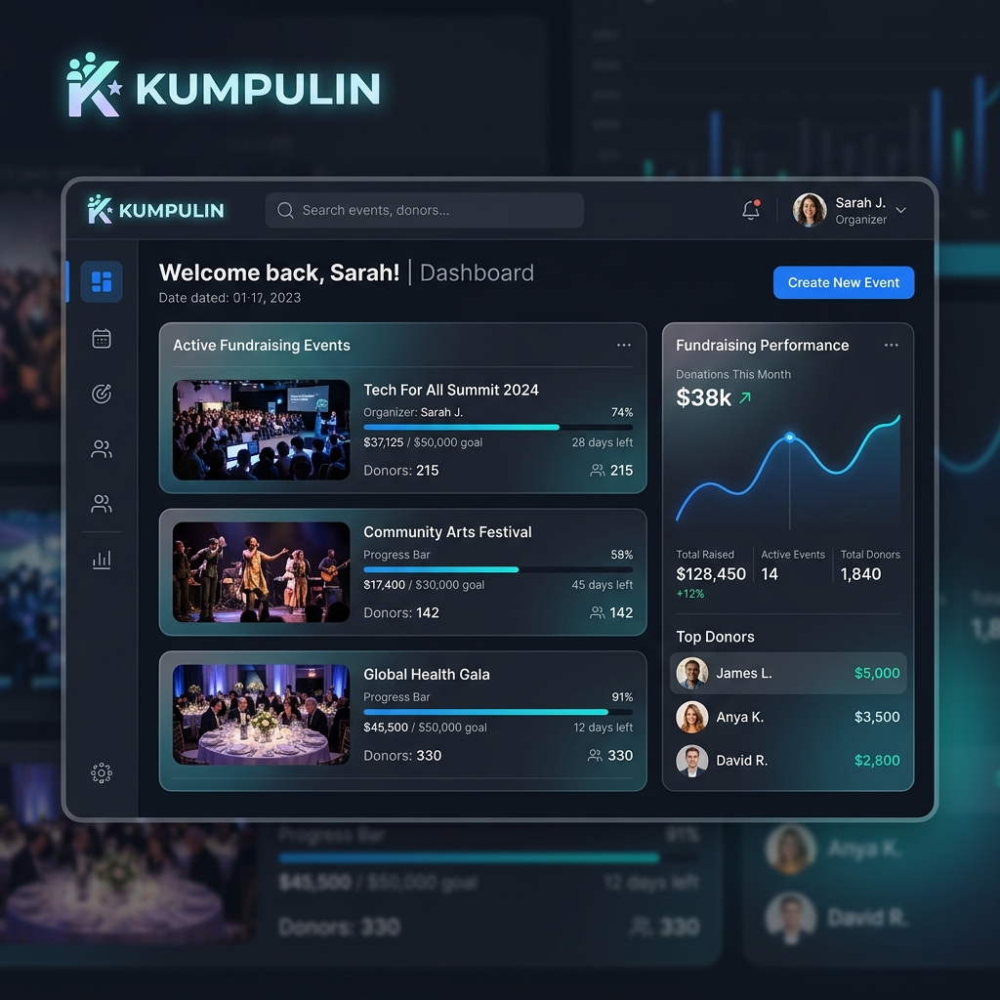
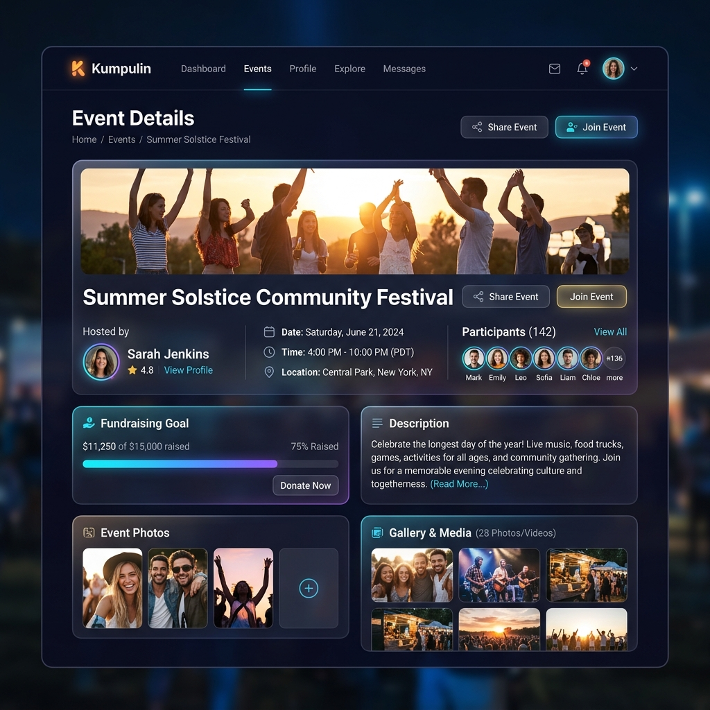

# 🗳️ Kumpulin - Event & Fundraising Manager

Kumpulin is a premium, modern web application designed to facilitate social events, community meetups, and fundraising collections. Built with a robust Laravel API backend and a dynamic React + Vite frontend, it delivers a glassmorphic, fluid, and engaging user interface.

---

## 🎨 Screenshots & Mockups

### 📊 Dashboard Workspace


### 📌 Event & Fundraising Details


---

## ⚙️ Tech Stack

### Frontend (Client)
- **Framework**: React 18 with Vite (HMR and Fast Refresh optimized)
- **UI Components**: PrimeReact, Mantine Core
- **Styling**: Tailwind CSS, PostCSS, Google Fonts (Poppins)
- **State Management**: Redux Toolkit, React Redux
- **APIs & Sockets**: Axios, SWR, Pusher JS, Laravel Echo

### Backend (Server)
- **Framework**: Laravel 10.x (API-only setup)
- **Database**: SQLite (Optimized for lightweight local development)
- **Auth & Security**: Laravel Sanctum, UUID-based Route Keys
- **Websockets & Events**: Beyondcode Laravel Websockets
- **Cloud Media**: Cloudinary integration for profile and cover photos

---

## 🚀 Getting Started

### Prerequisites
- **Node.js**: v18.x or v20.x+
- **PHP**: v8.1 or v8.3+
- **Composer**: Dependency Manager for PHP

---

### 💻 Client Setup

1. **Navigate to the client directory**:
   ```bash
   cd client
   ```
2. **Install node packages**:
   ```bash
   npm install --legacy-peer-deps
   ```
3. **Configure local environment variables**:
   Create a `.env` file inside the `client` directory and point the API base URL to your local server:
   ```env
   SECRET_KEY="r4Eg7Z9mARfZWsDRRsMXpoxFXksekegn"
   VITE_API_BASE_URL="http://127.0.0.1:8000/api/v1"
   ```
4. **Launch development server**:
   ```bash
   npm run dev
   ```

---

### 🗄️ Server Setup

1. **Navigate to the server directory**:
   ```bash
   cd server
   ```
2. **Install composer dependencies**:
   ```bash
   php composer.phar install
   ```
   *(If dependencies require package versions compatible with PHP 8.3+, run `php composer.phar update --with-all-dependencies`)*
3. **Setup environment config**:
   ```bash
   copy .env.example .env
   php artisan key:generate
   ```
4. **Database Configuration**:
   Ensure SQLite database file exists and setup the SQLite connection in `server/.env`:
   ```env
   DB_CONNECTION=sqlite
   ```
   Create empty SQLite file:
   ```bash
   # On Windows PowerShell:
   New-Item -Path database\database.sqlite -ItemType File -Force
   ```
5. **Run migrations & seeders**:
   ```bash
   php artisan migrate --seed
   ```
6. **Start local API server**:
   ```bash
   php artisan serve
   ```

---

## 🧪 Running Tests

### Frontend Linters
Verify JavaScript code styling and standard component patterns:
```bash
cd client
npm run lint
```

### Backend PHPUnit
Verify API request cycles, database transactions, and model handlers:
```bash
cd server
php artisan test
```

---

## 📁 Repository Structure
```
kumpulin/
├── client/          # React + Vite application (Frontend)
├── server/          # Laravel framework (Backend API)
└── assets/          # Shared mockups and application designs
```
